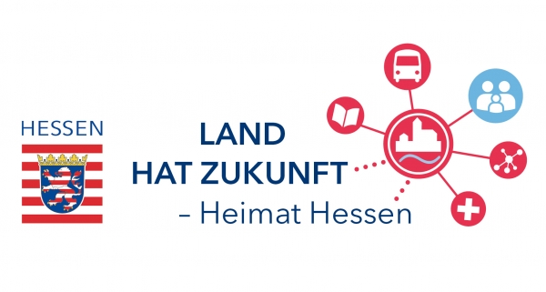

 Liebe Teilnehmerinnen und Teilnehmer,

Hessen ist ein wichtiger Messe- und Veranstaltungsstandort im Bereich der Digitalisierung, den die Landesregierung weiter stärken möchte. Ich freue mich, dass das XCamp erneut in Frankfurt stattfindet. Es ist ein Event von der Community für die Community. Sie haben hier die Möglichkeit Ihre Erfahrungen und verschiedene Innovationsmethoden mit Experten aus den unterschiedlichsten Disziplinen auszutauschen. Schwerpunktthemen in diesem Jahr sind Agiles Management und Innovation im Unternehmenskontext.

Durch die fortschreitende Digitalisierung müssen Unternehmen heute schnell auf wechselnde Trends und Anforderungen reagieren. Die Technologie dafür ist vorhanden, doch es scheitert oft an den starren Strukturen in Unternehmen, die Innovationen ausbremsen. Dynamisch statt statisch soll Management sein. Entscheidungen und passende Lösungen sollen unmittelbar parat sein. Agile Methoden können bei Innovationsprozessen wie ein Katalysator wirken. Oft fehlt jedoch die Erfahrung mit agilen Methoden. Hier gibt das XCamp Antworten und zeigt Strategien, wie der richtige Umgang mit digitalen Informationen zu Innovationen und einem Mehrwert für die Gesellschaft führen können. Durch den Erfahrungsaustausch mit Spezialisten und Gleichgesinnten können Sie viele neue Impulse und Einsichten erwarten.

Ich wünsche Ihnen einen inspirierenden Tag und einen spannenden Austausch.

Prof. Dr. Kristina Sinemus   
Hessische Ministerin für Digitale Strategie und Entwicklung

Bildnachweis: Prof. Dr. Kristina Sinemus, Hessische Ministerin für Digitale Strategie und Entwicklung © Staatskanzlei / Salome Roessler
