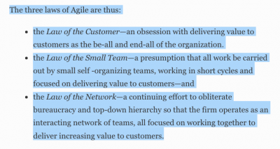

> ICH DENKE DAS THEMA IST “HOT” UND MÖCHTE ES DAHER AUF DEM XCAMP 2019 IN EINER WORKING SESSION MIT EUCH DISKUTIEREN UND LÖSUNGEN ERARBEITEN:

Früh und kontinuierlich Mehrwert für Kunden zu schaffen, ist (eigentlich) eines der Grundprinzipien hinter dem agilen Manifest. Doch einmal provokant gefragt: Wie viel Kundenmehrwerte (Customer Value) werden denn tatsächlich in agilen Projekten generiert?

Wenn wir ehrlich sind, sieht die Realität oft ernüchternd aus: User Stories, die einen tatsächlichen Mehrwert liefern würden, werden leider oft auf unbestimmte Zeit im Backlog “runterpriorisiert”. Wichtige Mechanismen für kundenzentrierte Entwicklung fehlen gänzlich im agilen Prozess. Das geht besser!

([Zitat aus Forbes](https://www.forbes.com/sites/stevedenning/2019/05/23/understanding-fake-agile/#1944085b4bbe): „Understanding Fake Agile“… )

Wie lassen sich agile Produktentwicklung und UX optimal verzahnen? Das ist – fast zwanzig Jahre nach der Veröffentlichung des agilen Manifests – immer noch umstritten und in vielen Projekten ungelöst. Wir haben es eher mit zwei „Fachbereichen“ zu tun, die sich getrennt rasant weiterentwickeln. Stichwort Lean UX, Spotify-Model, Design Ops, Research Ops … was die Verzahnung umso dringlicher macht.

In meinem ersten Scrum-Projekt 2005 tauchte schon die Frage, wie „UX in den Sprints stattfinden kann“ auf, in einem meiner letzten Strategie-Programme 2018 ging es ähnlich darum, wie Service Design und Lean UX in die Entwicklung integriert werden. Eigentlich bin ich vor 15 Jahren davon ausgegangen, dass dieses Thema schnell gelöst wird. (mein erster Konferenzvortrag dazu 2009, URL…).

##Die gute Nachricht
Die einzelnen Methoden werden immer besser und für sich genommen auch praktikabler. Es gibt zahlreiche neue und bereits erprobte Möglichkeiten, UX (und natürlich kundenzentrierte Innovation insgesamt) mit Design Thinking, Lean UX, Service Design, Customer Experience, … optimal in agile Prozesse zu integrieren.

##Also, alles geklärt?
Gerade unter UX-Experten (…und allen beteiligten, kundenzentrierten Rollen) ist es noch immer ein wichtiges Thema, das es zu lösen gilt. Denn die Entwicklung von innovativen Kundenlösungen bedürfen strukturell passender Bedingungen für interdisziplinäre Teams (mit Business-, User- und Tech-Focus). Viele Programme für Digitale Transformation werden intern als „… wir werden nun zu einem IT-Technologie-Unternehmen“ wahrgenommen. Die Perspektiven von „Agile“ und „Kundenzentrierung/ UX/ CX“ treten in ihrer Relevanz dagegen zurück. Jedoch, wenn man die Strategie von Großkonzernen (egal welcher Branche oder Unternehmensgröße) betrachtet, haben beide hohe Wirkung für den Erfolg des sich transformierenden Geschäftsmodells.

- **Agile/ Scrum (Prozess, Performance & Quantität)** – Die digitale Transformation findet auf Basis agiler Prozesse statt. Das Hauptziel sind dabei die wirtschaftliche Performance und iterative Weiterentwicklung der für das Geschäftsmodell relevanten (Digital/IT)-Systeme. Um diese zu realisieren, stehen optimierte Entwicklungsprozesse mit kontinuierlicher Output im Vordergrund.
- **UX/ Kundenzentrierung (Kundeninnovation & Qualität)** – In Zeiten sich schnell wandelnder Geschäftsmodelle (Stichwort Disruption, Shared economy, ) ist für Unternehmen die Ausrichtung auf Kundenbedürfnisse elementar wichtig – bzw. überlebensrelevant! Daher werden große Anstrengungen unternommen, die „Service und Produkt-Innovation“ für Kunden (B-to-C oder B-to-B) möglichst stabil in der Firmenkultur zu etablieren. Um dies zu realisieren, werden innovative Methoden eingeführt – sie sollen die Mitarbeitern für eine frische Lean Startup-Kultur öffnen.

##Worin liegen die Herausforderungen?
Kurz gesagt: Das Potenzial und die Herausforderung liegt in der firmenkultur-spezifischen Kombination und Integration der beiden Bereiche, denn sie stellen die Mindsets der angestrebten Kultur dar!

Während UX Designer den Anspruch verfolgen, die Lösung ganzheitlich (holistisch) mit Fokus „Mehrwert für die Zielgruppe“ zu entwickeln (z.B. in Form eines vorab getestet und validierten Click-Dummy), sind agile Workflows darauf ausgerichtet, kontinuierlich fertigen Output zu produzieren. Gerne erst einmal in einer Minimalvariante. Das kann im IT-Verständnis z.B. ein publizierter Onlineinhalt (Formular, Login, …) sein, der zumindest das technische Feature einer Basis User Story abdeckt.

Beide Ansprüche zahlen in einen großen Mehrwert für Unternehmen ein, werden jedoch häufig nicht sehr gut kombiniert und in den Firmenprozessen gelebt.

Wir denken das Thema ist “hot” und wollen es daher auf dem XCamp 2019 in einer Working Session mit euch diskutieren und Lösungen erarbeiten:

##5 Lösungsansätze für die Integration
Die folgenden Empfehlungen aus unterschiedlichen Fachbereichen sind bereits von Experten erprobte Möglichkeiten. Sie zeigen, dass sowohl UX-Experten als auch Agile-Experten Lösungen gefunden haben, die man in neue oder laufende Agile-Programme leicht integrieren könnte. Generell zielt jeder der Ansätze darauf ab, dass die verschiedenen Expertenrollen (UX, PO, Scrum Master, Tech-Team,..) besser miteinander interagieren und ihren Arbeitsansprüchen gerecht werden können, um qualitativen Output zu generieren. Ein gemeinsames Ziel!

Die 5 Lösungsansätze wollen wir euch im Teil 02 vorstellen:

- UX IN AGILE UND SCRUM (Jeff Gothelf, , )
- INTEGRATING UX AND USABILITY TESTIN IN AGILE (userzoom)
- Lean UX in SAFe
- Agile Prozesse mit Design Sprints optimieren
- UX Burner

Als Consultant, Leiter und Facilitator von Projektteams habe ich persönlich viele dieser Mechanismen explorativ in Projekten einfließen lassen und nach jedem Review wertvolle Learnings gezogen. Diese würde ich gerne in einer Working Session diskutieren und gemeinsam weiter erarbeiten.

> TEIL 02 – Die fünf Lösungsansätze genauer erklärt und bewertet. (folgt in Kürze…)
