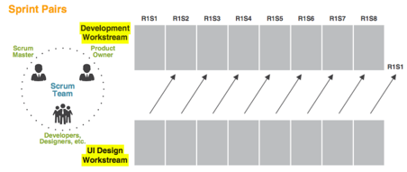
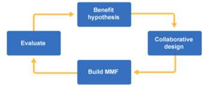

Ich stelle euch hier die bekanntesten Integrationsansätze für UX und Scrum inhaltlich vor. Alle, die beim XCamp darüber mitdiskutieren wollen, sollten mit den wichtigsten Grundlagen über Agile/Scrum vorab vertraut sein. Eine Einführung wird es in der Session aus Zeitgründen leider nicht mehr gegeben.

##5 Lösungsansätze für die Integration
- UX IN AGILE UND SCRUM (Jeff Gothelf, [gothelf.co](https://jeffgothelf.com/), [Scrum.org](https://www.scrum.org/))
- INTEGRATING UX AND USABILITY TESTING IN AGILE (userzoom)
- Lean UX in SAFe (Scaled Agile Framework)
- Mit DESIGN SPRINTS Agile Prozesse optimieren
- UX Burner

Die folgenden Empfehlungen aus unterschiedlichen, fachlichen Richtungen sind bereits von Experten erprobte Möglichkeiten, um UX und Agile wirkungsvoller zu kombinieren. Sie zeigen, dass sowohl UX-Experten als auch Agile-Experten Lösungen gefunden haben, die man in neue oder laufende Agile-Programme leicht integrieren kann.

Generell zielt jeder der Ansätze darauf ab, dass die verschiedenen Expertenrollen aus UX, PO, Scrum Master, Tech-Team,.. besser wahrgenommen werden, miteinander interagieren, um ihren eigenen “Arbeits-/Qualitätsansprüchen” gerecht werden können, und dadurch qualitativen Output zu generieren. Ein gemeinsames Ziel!

## UX IN AGILE UND SCRUM (Jeff Gothelf, [gothelf.co](https://jeffgothelf.com/), [Scrum.org](https://www.scrum.org/))

Jeff Gothelf ist wohl einer der meist genannten Namen, wenn es um dieses Thema geht. Er hat mit Kollegen einen integrierten Lösungsvorschlag von UX in Scrum entwickelt Er basiert hauptsächlich darauf, einen Standard-Scrum-Prozess durch bewährte UX Methoden wirkungsvoll zu erweitern. Jeff stellt dies ausdrücklich zur Diskussion und zur kontinuierlichen Weiterentwicklung vor.

(Bild: Jeff Gothelf (Blogpost) „Here is how UX Design Integrates with Agile and Scrum“)
Fünf Integrations-Empfehlungen hebt er besonders hervor:

1. **Product Backlog** – Wertvolle UX-Aktivitäten (wie Design Sprints, Research) können als Zuarbeit in das Product Backlog einmünden, um mehr Kundenzentrierung in die späteren Sprint-Backlogs zu tragen.

2. **Sprint Planning** – Wichtige Fragen bezüglich der späteren Produkt-Funktionalitäten (wie sieht der Flow, die Interaktion aus etc.), Akzeptanz-Kriterien werden hier besprochen und lassen sich durch Design Methoden & Tools optimal unterstützten. 

3. **Sprint Backlog** – Die taktische Design Arbeit sollte in das Sprint Backlog fließen, um mit diversen Sprint-Spezifikationen (Wireframes, Prototypen, Visuelles Design, Research, Content und Experimente) den Teammitgliedern zeitnah Beiträge für die Umsetzung zu liefern. Das Wichtige daran ist eine gute Priorisierung, die es allen im Team ermöglicht, parallel und gut verzahnt daran zu arbeiten.

4. **UX im Scrum Team** – arbeitet 100% im Team. In enger Zusammenarbeit mit Entwicklern, Produkt Owner und Scrum Master gewährleisten sie die beste Qualität für die Usability aller entstehenden Funktionen.

5. **Sprint Review** – Die gemeinsame Ergebnisauswertung im Team ist eine optimale Möglichkeit, um die UX-Outputs und Optimierungen für zukünftige Sprints Optimierungen zu besprechen, beispielsweise für… Design Reviews, Research Ergebnisse, Quantitative Analyse

Hinweis: Für diese und weitere Optimierungen von kundenzentrierter Entwicklung in Scrum werden durch Jeff Gothelf seit kurzem sogar internationale Zertifizierungs-Workshops in Kooperation mit [Scrum.org](https://www.scrum.org/) angeboten. 

Ein paar Links dazu:

- https://medium.com/swlh/here-is-how-ux-design-integrates-with-agile-and-scrum-4f3cf8c10e24?fbclid=IwAR3hYK-jyme6YGCaOy692AI7d4DDJc5ICqXjoSqvNfQNUH2fzePxqDtN08Y
- https://www.scrum.org/courses/professional-scrum-user-experience-training

##INTEGRATING UX AND USABILITY TESTING IN AGILE (userzoom)
Links: [userzoom.com](https://www.userzoom.com/), PDF Booklet „UX & Usability in Scrum“)

Bereits vor einigen Jahren stellte USERZOOM, ein bekanntes Unternehmen für Remote Usability Lösungen ebenfalls Integrations-Weisen vor, die 1:1 die agilen Mechanismen unterstützen und ergänzen. Der Fokus liegt dabei auf der Implementierung von User Research Methoden und der Weiterentwicklung mehrerer “Basis-Agile-Mechanismen”. Auch hierbei ist es das Ziel, die User Centered Design Mechanismen (v.a. User Research und Usability Testing) sinnvoll in agile Abläufe zu integrieren.

Beispielsweise für die prozessuale Integration von UX in Scrum werden vier Integrations-Möglichkeitenverglichen (weitere Informationen dazu findet Ihr im PDF Booklet von Userzoom)…

- **„Big Upfront Design“** – UX-Konzepter arbeiten vor dem Release
- **„Just in Time“** – Erstellung der Designs innerhalb eines Sprints
- **„Design Spikes“** – Parallel laufende Entwicklungsarbeit (ohne Roll-Out), außerhalb der Sprints
- **„Sprint Pairs“** – Die UX-Entwicklung erfolgt mit einem Sprint Vorlauf vor dem Entwicklungs-Sprint

*Bildbeispiel: Userzoom einer Integrations-Möglichkeiten „Sprint Pairs“*

Und zusätzlich werden **sieben bewährte Erfolgs-Mechanismen** (UX in Scrum) hervorgehoben, die einen starken Hebel für Optimierungen haben:

- UX Designer fest in die Scrum Teams einbinden
- Einbindung von UI Developer in Scrum Teams mit Reporting an UX
- Maßgeschneiderter Prozess für die UX-Teaminputs
- Einen Sprint/ Phase 0 für UX Research oder andere Vorbereitungsarbeiten
- Aktive Mitwirkung in allen folgenden Iterationen
- Nutzung von expliziten UX Metriken, um Verbesserungen zu fördern und Erfolgsnachweise zu liefern
- Aktives Management eines Usability-Issue Backlogs

##Lean UX in SAFe

Das Scaled Agile Framework (SAFe) wurde unter anderem entwickelt, um große Projekte & Programme auf mehrere parallele agile Teams aufzuteilen. Ihr Output wird wiederum in einem gemeinsamen s.g. “Agile Release Train” zusammengeführt, um eine s.g. Continous Delivery Pipeline zu gewährleisten. Insgesamt ist es ein sehr großes, mächtiges Framework, das aktuell in zahlreichen Unternehmen (im Rahmen von Digital Transformation Programmen) eingeführt wird.

Für die Einbindung von User Experience (UX) Workflows in SAFe werden seit längerem Lösungen in den SAFe-Spezifikationen gesucht, beschrieben und veröffentlicht. Denn die Arbeitsgruppen haben im Laufe der Versionierungen erkannt, dass die Einbindung dringend zu verbessern ist.

Ab den jüngsten Versionen (V4.5 …) fokussiert sich die Integration nun sogar auf Lean UX als integrierbaren Prozess. Ein gutes Zeichen, dass UX in SAFe weiterentwickelt, zukünftig ernst genommen und mit dem Framework weiterentwickelt wird. Nach letzter Aussage gibt es dazu nun sogar eine eigene Arbeitsgruppe bei SAFe. Einige der wichtigsten Kernmechanismen für die Integration von Lean UX in SAFe sind:

- Lean UX Process – Integration ins SAFe Framework als Workflow
- Lean UX Center of Excellence (LUXCE) – Integration auf allen SAFe Entwicklungs-Leveln
- Program Increment (PI) – in ausführlicher Form ist im Framework beschrieben wie Outputs aus dem LUXCE in den Program Increment Life Cycle

Obwohl Lean UX in SAFe sicherlich ein guter Ansatz ist, so gibt es dennoch zahlreiche Herausforderungen (Kritiken) an diesem Framework, die hoffentlich in zukünftigen Versionen adressiert werden:

- Challenge 1 – Customer Centered Design und Experten-Rollen sind nicht definiert
- Challenge 2 – Der Customer (und speziell kundenzentrierte Prozess) geht darin fast völlig unter
- Challenge 3 – Das Framework wirkt sehr bürokratisch und unhandlich

*Bild/ Diagramm Lean UX Process im SAFe Framework*

Die Links dazu:

- https://www.scaledagileframework.com/lean-ux/
- https://www.scaledagileframework.com/lean-ux-and-the-safe-program-increment-life-cycle/

##Agile Prozesse mit Design Sprints
Design Sprints sind eine Methode (Framework), um in einem Ablauf von fünf Entwicklungsphasen eine fokussierte Lösungshypothese zu entwickeln und mit der Zielgruppe zu testen. Sie erfreut sich seit Jahren wachsender Popularität, weil darin die wichtigsten Entwicklungsschritte (Understand > Ideate > Decide > Prototype > Test) in sehr komprimierter Form stattfinden. Kreativ und effizient zugleich.

Entstanden ist die Methode 2016 aus dem Startup und Lean Innovation Umfeld heraus. Da es sich um einen sehr kundenzentrierten Prozess handelt, wird heute auch viel darüber gesprochen, ihn mit den anderen agilen Methoden zu kombinieren. Was grundsätzlich viele Vorteile hätte, vor allem um die kundenzentrierte Konzeptentwicklung im agilen Prozess zu stärken. Als Integrationsmöglichkeit könnte beispielsweise ein Design Sprint im Rahmen eines agilen Sprints laufen oder davor oder parallel dazu. Es gibt mehrere Möglichkeiten (ähnlich den Integrationsmöglichkeiten von Usability Testing, siehe 2. Beispiel von userzoom).

Der Ablauf eines Design Sprint im Überblick:

- **Understand** – Den Lösungskontext, Customer Journey Mapping, das Problem und die Bedürfnisse der Zielgruppe, die Jobs (JTBD) sowie das Ziel verstehen.
- **Ideate** – Ideen sammeln und entwickeln, Recherche, Inspirationen aus anderen Branchen holen und Lösungs-Skizzen entwerfen.
- **Decide** – Entscheiden welche der Ideen weiterverfolgt und umgesetzt werden. Entwicklung eines Storyboard (User Flow) für die Wireframes und den Prototyp.
- **Prototype** – Das Team entwickelt optimalerweise im Team den Prototyp (Aufteilung der Zuarbeiten: Copy/Text, Wireframes/Interaction, Content/Assets, Prototyping etc.)
- **Test** – Der Prototyp wird mit Nutzern (aus der Zielgruppe) getestet. Optimales Set-Up wären 2 Testräume, 5 Testkunden. Anschließende Auswertung mit Optimierungen.

**Weiterentwicklungen von Design Sprint (DS)**: Aufgrund seiner Beliebtheit wird der DS-Prozess durch seine Community immer weiterentwickelt. In der neuesten 3.0 Version wird am ersten Tag nun ein sogenanntes “Problem Framing” mit Business-Stakeholdern durchgeführt, um den Fokus vorab zu definieren.

##UX BURNER

Ein weiterer, leichter frischer Ansatz: Der UX BURNER ist ein holistisches Product Design und Entwicklungsframework das Agile und Lean Product Design in einem Prozess vereinen soll.

Ausgegangen wird von der Tatsache, dass durch Lean Startup und Design Thinking viele neue Frameworks entstehen (Lean UX, Design Sprint, Hook Model, …), es jedoch gleichzeitig wenig Empfehlungen gibt, wie diese mit den Workflows Agiler Entwicklungsteams flüssig zusammenarbeiten.

> „Wouldn’t it be great if we had just one, holistic product design & development framework that is both User-Centered and Agile?“

Einige der genannten, typischen Probleme & Herausforderungen durch eine „schlechte Verzahnung“ von UX und Agile:

- UX Entwicklung wird in Sprints nicht priorisiert
- UX Research-Erkenntnisse fließen oft nicht in den Entwicklungsprozess
- Problemlösungen entstehen oft isoliert von agilen Umsetzungsteams
- Designs werden von Entwicklern falsch interpretiert

*UX BURNER*

UX BURNER gibt darauf eine Antwort, die Step by Step beschrieben wird. In einfacher Form dargestellt, wird im normalen Sprintablauf ein Designsprint durchgeführt Tag 1-5 mit folgenden Aktivitäten:

1. Problem Framing mit Burner Canvas
2. Design Workshop
3. Prototyping
4. Pair & Share
5. User Test

Varius natoque turpis elementum est. Duis montes, tellus lobortis lacus amet arcu et. In vitae vel, wisi at, id praesent bibendum libero faucibus porta egestas, quisque praesent ipsum fermentum placerat tempor.

Die Links dazu:

- YouTube Intro: https://www.youtube.com/watch?v=KbHVnW6TC2Q
- Blog Post: https://medium.com/ux-burner/a-diy-guide-to-integrate-ux-design-and-scrum-6e954ab08f28

##FAZIT & AUSBLICK

Alle diese Integrationslösungen zeigen erst einmal, dass das Thema weiterhin eine Herausforderung darstellt (Verbindung von Customer Centered Design und Agile Development) – jedoch mit guten Lösungsmöglichkeiten, wie das Versprechen „Value to the Customer“ in Agilen Projekten besser eingelöst werden kann.

Grundsätzlich macht es viel Sinn, mit einigen der hier beschriebenen Verbesserungsmechanismen zu beginnen und zu experimentieren. Um eigene Erfahrungen zu sammeln. Wir haben in jedem unserer Projekte mit dem Team überlegt, welche Verbesserungen uns “Quick Wins” verschaffen könnten. Und meistens kommt man auf 3-5 dieser Methoden die ein nennenswerten Impact erzeugen (ergebnisorientiert) und auf deren Aufmerksamkeit man aufbauen kann.

Da Kundenzentrierte Innovation gerade einen regelrechten Hype erlebt – durch Unternehmens-Strategien in unterschiedlichen Bereichen (Customer Experience Strategie, Lean Innovation, Design Sprints, User Experience Prozesse, Team Transformation, Mitarbeiterenwicklung uvm.) – wird dieses Thema in Zukunft wohl eher noch etwas relevanter und wichtiger werden. Die Komplexität des Ganzen trägt ihren Teil dazu bei.

Ich freue mich auf den Austausch mit euch zu den Erfahrungen, Vor- und Nachteilen der von euch praktizierten Ansätze. Idealerweise kommen wir zu einer gemeinsamen Empfehlung, Lösungsentwürfen oder gar eigenen Adaptionsansätzen.

Wenn ihr Fragen oder Anmerkungen zu diesem tollen Thema habt, könnt ihr mich gerne unter Wolf Nöding (www.wolfnoeding.de) bei Xing oder Linkedin kontaktieren.

Wir treffen uns auf dem XCamp!
