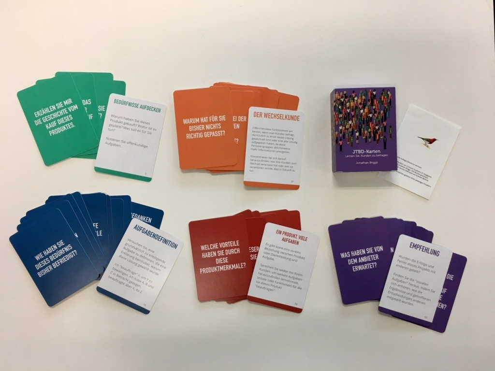

Wie schon der Innovations-Vordenker und Harvard Business School Professor, Clayton M. Christensen, sagt:

„Um die Innovationstätigkeit vom Schuss ins Blaue auf die Ebene der Vorhersehbarkeit zu heben, müssen Sie den dahinterstehenden Kausalmechanismus verstehen – die Fortschritte, die ein Verbraucher unter bestimmten Umständen machen möchte.“

##Fortschritt ist das neue Paradigma
Customer Needs, Kundenprobleme oder Kundenbedürfnisse sind bis heute die gängigen Erklärungen für die Motivation, nach neuen Lösungen zu suchen. Diese Sichtweise greift jedoch zu kurz, denn allein wegen eines Problems oder „Needs“ greift niemand zu einem neuen Produkt oder Service. In der Realität spielen wesentlich mehr Faktoren eine Rolle. Spätestens seit Christensens Buch Competing Against Luck: The Story of Innovation and Customer Choice beginnt sich die Auffassung durchzusetzen, dass den Kunden nur eine Frage interessiert: Verschafft mir das den gewünschten Fortschritt?

##Den Wunsch nach Fortschritt verstehen, aber wie?
Mit Hilfe der richtigen Vorgehensweise, einem Mix aus strukturierten Kundeninterviews und deren Auswertung, lässt sich darstellen, welchen Fortschritt Kunden suchen, wie Kunden heute um eine Lösung ringen und wo die Innovations-Potenziale liegen.

*Jobs-to-be-done Interviewkarten*

##Das Wheel of Progress
Auf dem XCamp 2019 werde ich das Wheel of Progress (WoP), ankündigen, welches die Merkmale des Prozesses zu Fortschritt darstellt: Ein Werkzeug, das auf den Erkenntnissen der Jobs to Be Done-Theorie basiert und den „Best Practices“ ihrer Anwendung. Das WoP hilft zu entscheiden, welche Kunden-Jobs besonders lohnend sind und bietet darüber hinaus einen Anschluss an den populären Business Model Canvas.

*The Wheel of Progress*

##Neugierig geworden?
Kommt in den Interview-Mini-Workshop und erfahrt, wie man mit Hilfe des Wheel of Progress und der Jobs to Be Done-Interviewkarten den Fortschritt darstellen kann, den Kunden suchen.

##Über den Autor
Eckhart Böhme ist Innovations- und Produktmangement-Berater. Als einer der „führenden Köpfe“ der Jobs to Be Done-Theorie im deutschsprachigen Raum, hat er hunderten Workshop-Teilnehmern die Anwendung dieses Denkansatzes beigebracht. Er war fachlicher Berater der deutschen Übersetzungen von Clayton Christensens Buch Competing Against Luck und Eric Ries Buch The Startup Way. Als Curriculum Architect bei Microsoft war er verantwortlich für die Marketing-Weiterbildung der Mitarbeiter in der Konzernzentrale in Redmond. Eckhart lebt heute in Mainz betreibt die deutschsprachige Jobs to Be Done-Ressourcen-Webseite jtbd.de.

