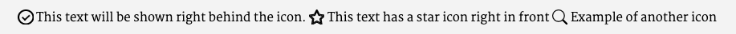

# Content for xcamp.co website

This repository contains the content of https://xcamp.co

When pushing to `master`, the website is automatically updated in a minute. There is also a `preview` branch,
which is shown in https://test.xcamp.co - this should be used to test the changes, before merging to the `master`
branch.

## Page content

Pages are described with Markdown, a text format used to easily define simple formatting.
It is described in https://github.com/showdownjs/showdown/wiki/Showdown's-Markdown-syntax

All pages have an extension `.md` for "Markdown".

Each page should contain a "meta" block, which is at the beginning of each page and is surrounded by lines of three
dashes `---`.

The meta block contains at least the following fields:

- **layout** - Should be set to `standard` in most of the cases, but could specify another template if needed.
- **title** - The title of the page.

## Special page types

There are two special kinds of pages, blog articles (located in `/blog`) and team member pages (located in `/team`).

Blog pages should have their `layout` meta field set to `blog`, team member pages should have the `layout` value
`member-page`.

The meta block contains the following additional fields:

### blog pages

- **authorPage** - The name of the authors page (in `/team` folder, don't use the `.md` here, just the name)
- **author** - The name of the articles author - you can leave that blank, if you have specified a `authorPage` and this
  page contains a `title` 
- **published** - The publishing date of the article.
- **image** - Name of the image file which should be used in the article list.
- **tags** - Comma separated list of tags for this article

### team member pages

- **image** - File name of a profile picture of the team member.

In blog pages, you can use a html comment `<!--more-->` in the markdown text to mark the position to stop showing
preview text in the article list.

## Styling

### Blocks

To create coloured blocks, we use lists prepended by a line containing the keyword `%blocks%`. If you use an ordered list, the elements are shown side by side, while unordered list elements have a little space in between. Depending on the number of list elements, the boxes use the whole page width, one half, a third or a quarter. If it is more than four list elements, each one uses a third, and the others breaks into the next row.

List elements can be styled by explicitly setting a css class.
This can be done by using `=<css-classname>` directly at the beginning of the list element, followed by a blank line like in the following example:

```markdown
- =yellow

  This is the list element's text which will be shown with css class 'yellow'.
```

### Text

Text can be styled by surrounding it with percent signs and css class names at the beginning, separated by a colon:

```markdown
%turquoise button: Buy now%
```

This results in HTML like `<span class="turquoise button">Buy now</span>` which can be easily used in a link, which actually makes it a button.

### Icons

You can create icons by using certain specifiers wrapped in colons like in this example:

```markdown
:checkmark: This text will be shown right behind the icon.
:star: This text has a star icon right in front
:search: Example of another icon
```

This will result in


