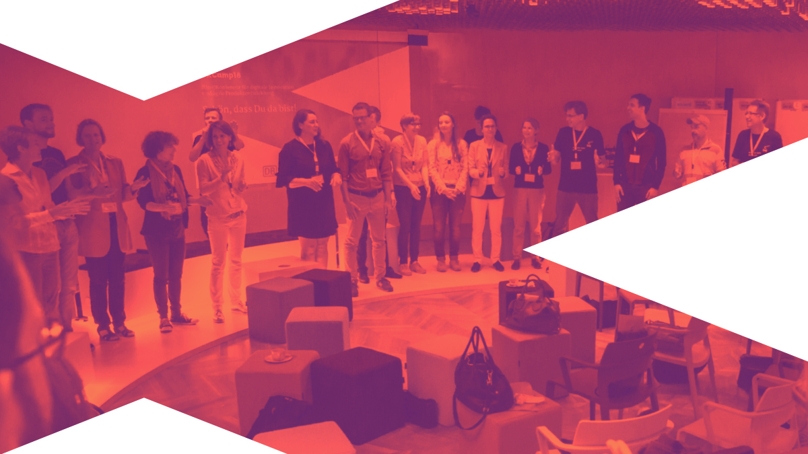

## XCamp digital Meetup

### Am 26. Juni 2020 von 17 - 20 Uhr bei dir zu Hause

%blocks%

- =yellow

  **Wir laden dich zum Auftakttreffen der digitalen XCamp Community ein**

  Sei von Anfang an mit dabei, wenn sich die agilen Innovations- und Veränderungstreiber der Region interdisziplinär austauschen, gemeinsam lernen und experimentieren.

- =magenta

  **Was wir vorhaben:**

  17:00-17:30 Get together

  17:30-18:00 Vorstellen von Session-Vorschlägen, Voting

  18:00-19:30 3-4 Parallele Zoom-Sessions zu Erfahrungen, Experimenten, interaktivem Lernen rund um die Kernthemen Agilität und Innovation

  19:30-20:30 Socializing

  19:30-20:00 Optional Breakout: Vorstellen der digitalen Community-Plattform des XCamps

[%turquoise button: Teilnehmen%](https://www.meetup.com/de-DE/XCamp-Meetup/events/271106925)

### Wie es zur digitalen XCamp Community kam

In all den Jahren der XCamp Organisation hatten wir immer wieder den Gedanken, die Teilnehmer auch im Rest des Jahres enger in den Austausch zu bringen. Der Spirit, der uns bei den Events jedes Mal begeistert, der lebhafte Austausch von Erfahrungen und Wissen sollte doch auch jederzeit möglich sein! Nun besorgte Corona den Rest und brachte uns dazu, jetzt wirklich etwas auf die Beine zu stellen, um mit der Community und für die Community in den kontinuierlichen Austausch zu gehen.

### Wie wir den Austausch organisieren

%blocks%

- =yellow

  **Community Chat**

  Wir stellen euch Plattform zur direkten, themenbezogenen Kommunikation bereit. Abonniere einfach die Kanäle, die dich interessieren. Du willst selbst ein Thema moderieren? Melde dich gern bei uns.

- =turquoise

  **Digital Meetups**

  Im unregelmäßigen Rhythmus organisieren wir zu einzelnen Themen Meetups (aktuell Remote). Besprecht im Community Chat, was euch interessiert und wann ein guter Termin dafür wäre.

- =magenta

  **XCamp Live-Event**
  
  Natürlich wollen wir auch wieder ein Live-Event an einer coolen Location organisieren, wenn nicht noch in diesem, dann spätestens nächstes Jahr!

%blocks%

- [%turquoise button: Teilnehmen am Digital Meetup Auftakt%](https://www.meetup.com/de-DE/XCamp-Meetup/events/271106925)

- [%yellow button: Der XCamp Community beitreten%](https://community.xcamp.co/)
