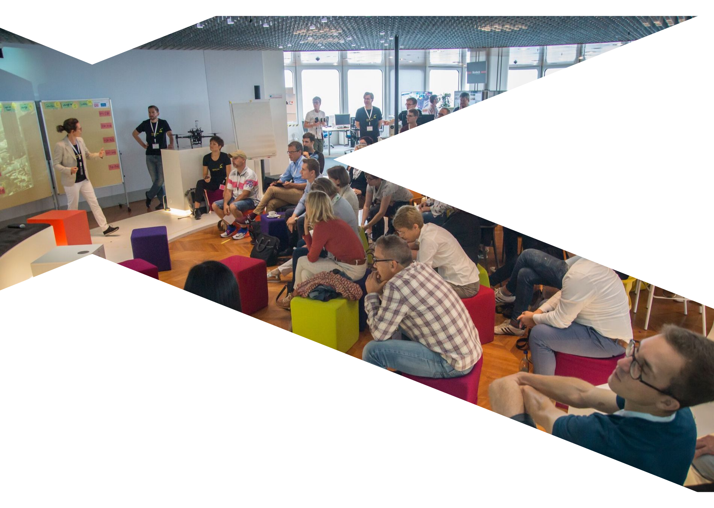
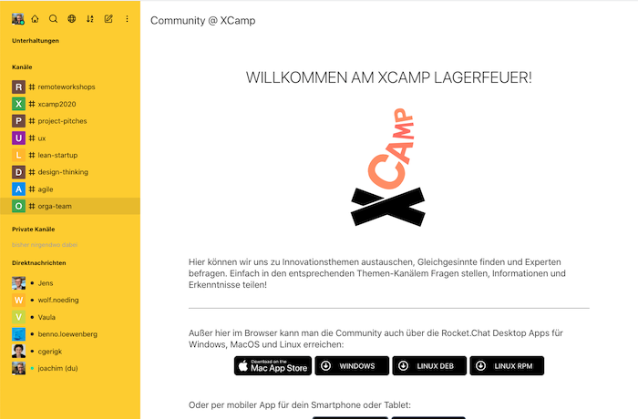
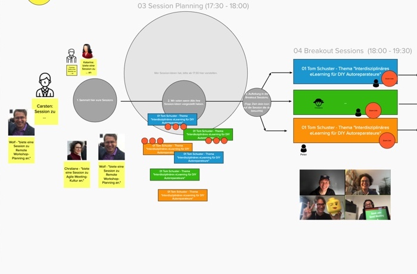
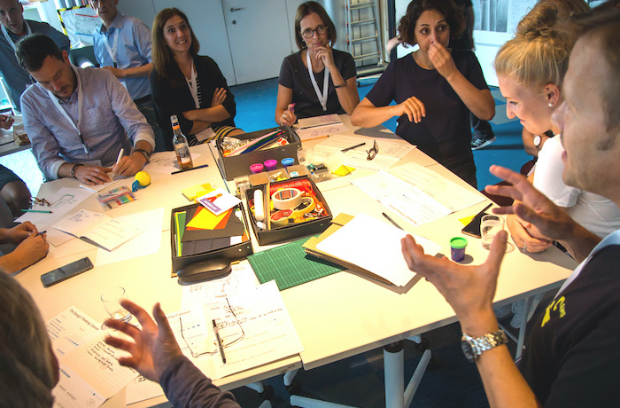

%hero%

- 

  ## XCamp digital Meetup

  ### Am 26. Juni 2020 von 17 - 20 Uhr bei dir zu Hause

%blocks%

- =yellow

  ### Wir laden dich zum virtuellen Auftakttreffen der XCamp Community ein

  Sei von Anfang an mit dabei, wenn sich die agilen Innovations- und Veränderungstreiber der Region interdisziplinär austauschen, gemeinsam lernen und experimentieren.

  **Termin: 26. Juni 2020**

  Anmeldung über Meetup, Teilnahme über Zoom, interaktiv wird es in Mural.

  [%magenta button: Teilnehmen%](https://www.meetup.com/de-DE/XCamp-Meetup/events/271106925)

- =magenta

  ### Was wir vorhaben

  17:00-17:30 Get together

  17:30-18:00 Vorstellen von Session-Vorschlägen, Voting

  18:00-19:30 3-4 Parallele Zoom-Sessions zu Erfahrungen, Experimenten, interaktivem Lernen rund um die Kernthemen Agilität und Innovation

  19:30-20:30 Socializing

  19:30-20:00 Optional Breakout: Vorstellen der digitalen Community-Plattform des XCamps

### Digitale XCamp Community

In all den Jahren der XCamp Organisation hatten wir immer wieder den Gedanken, die Teilnehmer auch im Rest des Jahres enger in den Austausch zu bringen. Der Spirit, der uns bei den Events jedes Mal begeistert, der lebhafte Austausch von Erfahrungen und Wissen sollte jederzeit möglich sein! Jetzt bringt uns Corona dazu, den Schritt zu gehen: mit der Community und für die Community in den kontinuierlichen Austausch.

### Wie wir den Austausch organisieren

%blocks%

- =white

  

  ### Community Chat

  Für die typischen XCamp Themen gibt es bereits Kanäle zum Austausch.

  Du willst selbst einen Themen-Kanal moderieren? Melde dich gern im Kanal [#orga-team](https://community.xcamp.co/channel/orga-team)

  [%magenta button: Bbeitreten%](https://community.xcamp.co/)

- =white

  

  ### Digital Meetups

  In unregelmäßigen Abständen organisieren wir zu einzelnen Themen Meetups.
  
  Entweder als Mini-Barcamp oder im Lean Coffee Format.

  [%magenta button: Teilnehmen%](https://www.meetup.com/de-DE/XCamp-Meetup/events/271106925)

- =white

  

  ### XCamp Live-Event
  
  Natürlich wird es wieder ein Live-Event an einer coolen Location geben.
  
  Ihr erfahrt davon, sobald Corona uns wieder lässt.
