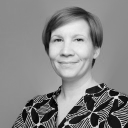
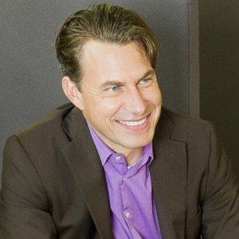
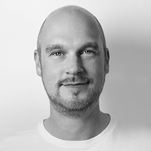
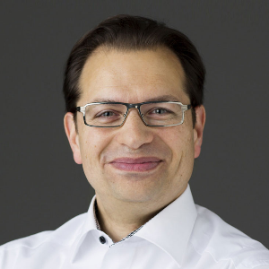
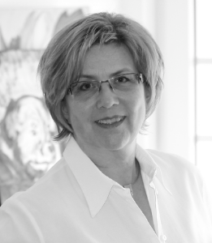
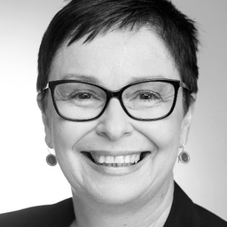
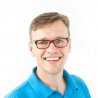

# Wir stellen uns vor - das XCamp Orga-Team 2019

Hinter dem XCamp steht ein vielseitiges, motiviertes Team von Kreativen, Entwicklern, Designern, Innovations- und
UX-Beratern. Uns eint der gemeinsame Wunsch: Es soll wieder ein XCamp für die Innovationstreiber und
Organisationsbeweger in der Rhein-Main Region geben. Die meisten von uns waren mehrfach bei LeanCamps oder XCamps dabei
und wollen, dass es wieder einen dieser hochintensiven Tage zum Austauschen, Vernetzen und Lernen rund um die
Erfahrungen und Methoden der Praxis gibt. Wir verbinden damit das Bild vom Lagerfeuer. Sich treffen und offen mit
Gleichgesinnten über Erlebtes, über Erfolge und Hindernisse sprechen, die uns im Unternehmensalltag begegnen.

Wir stehen hinter alle den agilen Prinzipien und wenden sie auf unsere unterschiedlichen Tätigkeitsfelder an. Seht
selbst, wo wir uns jeweils bewegen.

- 
    - ## Vaula Aalto

        Ich beschäftige mich im Alltag vorwiegend mit den Themen Konzeption und Screendesign sowie organisiere gemeinsam mit
        meinen Kollegen Workshops. Am Anfang des Jahres 2019 habe ich mich als Scrum Master und Product Owner zertifiziert.

        ### Kontakt

        - https://www.pagemachine.de/
        - [Twitter](https://twitter.com/frauwelle)

- 
    - ## Lin Vogel

        Wir befinden uns mitten in einem Wertewandel: In einer Welt, deren endliche Ressourcen eine Neuordnung  verlangen, deren
        breite Digitalisierung, unseren Alltag beeinflusst. In meinem Umfeld bedeutet dies: Kundenverhalten ist immer schwerer
        prognostizierbar. Mitarbeiter haben andere Bedürfnisse. Unternehmen müssen umdenken und sich den Veränderungen anpassen.
        Ich freue mich mittendrin zu sein und meine Schwerpunkte: Marketing, Projektmanagement und Business Development in neue
        Denkstrukturen zu führen.

        ### Kontakt

        - [Twitter](https://twitter.com/@frau_lin19)

- 
    - ## Wolf Nöding

        Unternehmen richten ihre Entwicklungsprozesse intensiv auf Kundenzentrierung aus, was über die Digitalisierung hinaus in
        einem Kontext der sich verändernden Businessmodelle steht – es entstehen so beispielsweise Omnichannel-Services und
        -Lösungen. Wolf Nöding unterstützt die digitalen Transformations- und Innovationsprozesse seit ca 20 Jahren und ist
        heute tätig als Berater und Agile-Team-Facilitator. Seine fachlichen Schwerpunkte liegen im Bereich Customer
        Experience, Service Design, UX, Agile und Lean Innovation. Er hat Erfahrungen als Freelancer und Teamleiter, und tätig
        in Großkonzernen, Accelerator und Agenturen.

        Er hat mehrere Jahre Berufserfahrungen in USA/Europa und ist zertifiziert in: CX, UX, Scrum Product Owner, Lean UX,
        Design Sprint, Business Analyst, uvm., ist ursprünglich diplomierter Industrial Designer und erhielt eine Auszeichnung
        in Computer Science für digitale Navigationssysteme. 2001 gründete er in Deutschland mit einer kleinen Gruppe die
        Deutsche IA/UX-Community. Und hält u.a. Workshops im Bereich Customer Experience.

        ### Kontakt

        - https://www.wolfnoeding.de/
        - [LinkedIn](https://www.linkedin.com/in/wolf-h-noeding-3a77722/)
        - [XING](https://www.xing.com/profile/WolfH_Noeding/cv)

- 
    - ## Joachim Schirrmacher

        Agiler Software-Produkt-Entwickler (BizDevOps). Wertschaffungs-Netzwerke sind meine Passion, sprich mit mir darüber,
        wie sie funktionieren.

        Wie Menschen im Netzwerk zusammenarbeiten, ist mir auch als XCamp Organisator wichtig. Um diese Netzwerke besser zu
        verstehen, habe ich das NetVis Tool geschaffen.

        ### Kontakt

        - [XING](https://www.xing.com/profile/Joachim_Schirrmacher)
        - [Twitter](https://twitter.com/jschirrmacher)

- 
    - ## Stefan Rudersdorf

        Seit fast zwei Jahrzehnten unterstütze ich als Freelancer internationale Unternehmen als Informationsarchitekt und
        UI/UX-Designer. Ich interessiere mich für flexible Designsysteme und darf seit 2018 genau daran für Fidelity in globaler
        Verantwortung arbeiten.

        ### Kontakt

        - [XING](https://www.xing.com/profile/Stefan_Rudersdorf/)
        - [LinkedIn](https://www.linkedin.com/in/srudersdorf/) 

- 
    - ## Benno Loewenberg

        Als Google Design Sprint Master helfe ich „Innovation“ mit Leben zu füllen durch Vermittlung und Anwendung von 
        Innovationsmethoden zur erfolgreichen Kundenorientierung.

        Als strategischer Gestalter helfe ich „Digitalisierung“ mit tatsächlichen Lösungen anzureichern durch 
        Designsysteme-Entwicklung für skalierbare und konsistente Nutzererlebnisse und Markenwahrnehmungen digitaler Produkte 
        und Services.

        Als Startup-Mentor und Innovationsberater bin ich u. a. in den Innovation Labs von Google und den Vereinten Nationen 
        tätig.

        ### Kontakt

        - https://loewenberg.info/design
        - [Twitter](https://twitter.com/BennoLoewenberg)

- 
    - ## Gudrun Traumann
        Ich entwickle und setze um, Konzepte zur Social Media Optimierung (Webauftritt, Blog, Twitter und PR usw.) 
        Unternehmenspräsentation wie Elevator Pitch, Pecha Kucha etc. Dazu erarbeite ich/realisiere ich mit meinen Kunden 
        Methoden für einen erfolgreichen Vertrieb, kreatives Marketing und effizientes Business Development. Basis sind 30 Jahre
        Berufserfahrung in dynamischen Märkten.

        ### Kontakt

        - https://www.gudrun-traumann.com/
        - [Twitter](https://twitter.com/GudrunDT)

- 
    - ## Bianca Schimmel

        Ich verstehe mich als „Entwicklungshelferin“ – für Menschen, Teams und Organisationen im Wandel. Potenziale entfalten, 
        mutig Neues zu erkunden und Veränderungsprozesse gestalten, in denen der Mensch im Mittelpunkt steht. Was mich dabei 
        leitet: Aus Vielfalt schöpfen: Diversität und kulturelles Miteinander sind für mich Bereicherung und Inspiration; 
        lebendige Verbindungen knüpfen: ich glaube an die Kraft von interdisziplinären und selbstorganisierten Teams und 
        Netzwerken und schaffe Rahmen und Räume für Begegnung, Kooperation und Austausch; positives Menschenbild: Wertschätzung,
        Toleranz, Dialog auf Augenhöhe sind wichtige Werte für mich.
        
        ### Kontakt
        
        - https://www.bianca-schimmel.de/

- 
    - ## Jens Bothmer
        Mit Innovationsmethoden wie Design Thinking hilft Jens Bothmer Unternehmen dabei, gute Ideen in erfolgreiche 
        Geschäftsmodelle umzusetzen. Mit Trainings, Workshops und Keynotes unterstützt Jens in den Schwerpunkten Agile 
        Innovation, Digital Workplace und Change Management. Sein Wissen erstreckt sich auf mehr als 15 Jahre unternehmerischer 
        Erfahrung in den Bereichen General Management, Strategisches Management und Business Development. Branchenkenntnisse 
        besitzt er in den Bereichen Media, Telekommunikation, Smarthome und Internet.
        
        ### Kontakt
        
        - https://www.autentity.de/
        - [Twitter](https://twitter.com/@JensBothmer)

- 
    - ## Dr. Christiane Gerigk

        New Learning Facilitator oder klassisch: Trainerin, Coach und Moderatorin. In meiner Arbeit dreht sich alles darum, 
        Menschen für die digitale und agile Veränderung zu gewinnen. Die Formate und Bezeichnungen meiner Angebote wechseln; 
        immer geht es um die Nachvollziehbarkeit des Veränderungsbedarfs, die eigene Motivation und den Einstieg in die neue 
        Lern- und Arbeitsformen.
        
        ### Kontakt
        
        - https://www.digital-wachsen.de/
        - [Twitter](https://twitter.com/c_gerigk)
