# XCamp 2017: Innovate agile. Start lean.
Am 11. November 2017 trafen sich auf dem XCamp in Wiesbaden Innovationstreiber aus Unternehmen und Start-ups, Design Thinker, Agile und Lean Startup-Experten der Metropolregion Frankfurt Rhein Main.

%blocks%

- =yellow

  
  ### Zuhören und praktisch Eintauchen
  Erlebe Keynotes, hands-on Workshops und Open Space-Sessions zu Agilen Methoden, Lean Startup, Design Thinking, Business Modell Generation und den Erfolgsbedingungen für die Praxis.

- =yellow

  
  ### Inspiration erleben und vernetzen
  Gewinne durch Erfahrungsaustausch, interaktives Lernen und Workshops neue Einsichten und Motivation. Vernetze Dich mit Gleichgesinnten und Spezialisten, die neue Impulse geben.

- =yellow

  
  ### Schwung ins Unternehmen tragen
  Erfahre selbst, wie Du kreativer wirst und mehr Wirksamkeit in Innovationsprojekten erreichen kannst. Setze anschliessend das Gelernte bei Dir vor Ort erfolgreich in die Praxis.

## Letzte [Blog-News](blog) zum XCamp 17

%blocks%

<ul id="newest-blog-entries"></ul>

## Sessions auf dem XCamp 2017

%blocks%

- =magenta

  ### Brant Cooper
  
  
  [CEO Moves the Needle Inc. & Author of The Lean Entrepreneur](https://www.brantcooper.com/)
  
  **Keynote**
  
  5 Startup Myths That Will Destroy Your Company

- =turquoise

  ### Martin Strunk
  
  
  [DB Systel GmbH](https://www.dbsystel.de)
  
  **Ausgerechnet die DB Systel!**
  
  Aus der Praxis einer agilen Transformation
  
- =turquoise

  ### Benno Löwenberg

  
  
  @BennoLoewenberg
  
  **Google Design Sprint**
  
  Der Methodenmix von Google im Vergleich und Zusammenspiel mit Design Thinking und Lean Startup.

- =turquoise

  ### André Dörfler
  
  
  R + V Versicherung
  
  **Das Personalressort der R+V als Innovations-Promotor**

- =turquoise

  ### Marc Frey
  
  
  Simplify
  
  **Wir haben das schon immer anders gemacht!**
  
  Lean Startup Methoden in der Unternehmenswirklichkeit

- =turquoise

  ### Jens Bothmer
  
  
  Autentity Innovationberatung
  
  **Geschäftsideen mit neuen Innovationsmethoden entwickeln am Beispiel Design Thinking**

- =turquoise

  ### Torsten J. Koerting
  
  
  The Game Changer
  
  **Von der Ursache geile Geschichten zu erzählen bis zur Umsetzung**

- =turquoise

  ### Andrea Heisel, Soete Klien
  
  GIZ
  
  **Es geht doch anders!**
  
  Erfahrungen bei der Einführung von agilen Prozessen

- =turquoise

  ### Hülya Kaya und Lutz Fischer
  
  DB Systel GmbH
  
  **Management 3.0**
  
  Kultur(r-)evolution – Freiheit – Freiräume – mehr Verantwortung @DB Systel

- =turquoise

  ### Britta Ollrogge
  
  Britta Ollrogge Consulting
  
  **Story Telling, Metaphern und Modelle**

  Eine kreative Retrospektive unter Verwendung von LEGO®-Materialien  
  
- =turquoise

  ### Wolf Nöding
  
  Wolf Nöding Consulting
  
  **Lean UX**
  
  Mehr Kundenzentrierung und Innovation in klassischen agile Prozessen
  
- =turquoise

  ### Nicolas Scheel
  
  DER Touristik
  
  **Software, die Mitarbeiter nutzen *wollen* – und nicht sollen**
  
  
- =turquoise

  ### Jane Schek
  
  **Bitte recht empathisch!**
  
- =turquoise

  ### Julian Hofmann
  
  Etecture
  
  **Innovation Circle**
  
  Mitarbeiter-zentrierte Innovationsmodelle fördern

## Eindrücke vom XCamp

%blocks%

- 
- 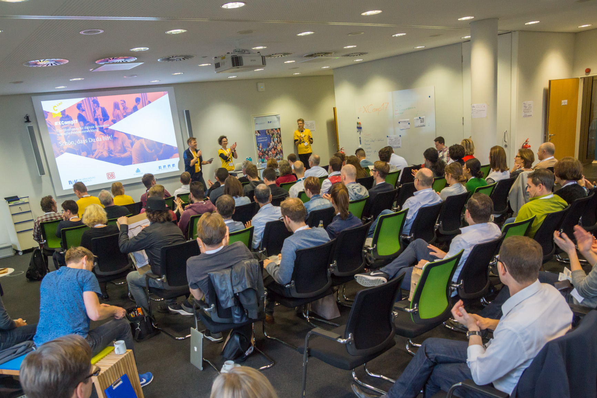
- 
- 
- 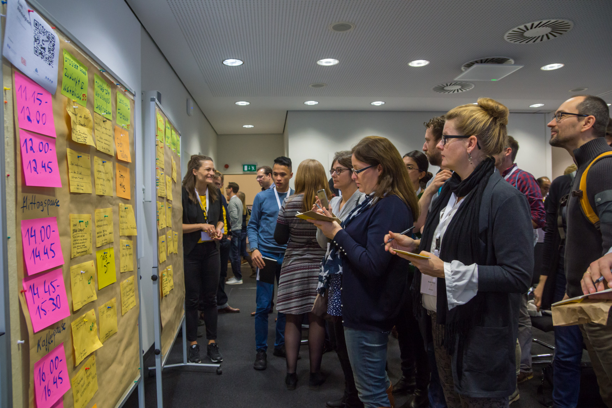
- 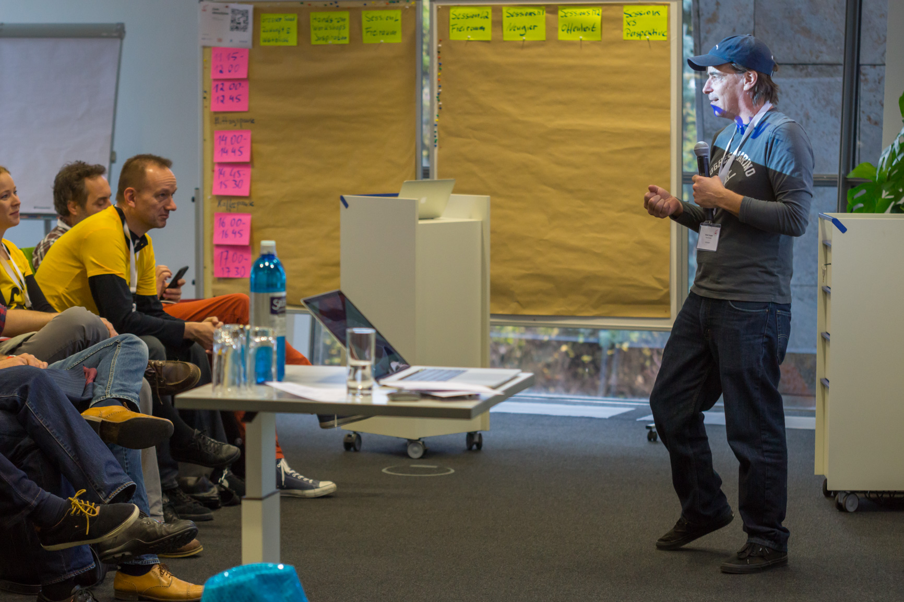
- 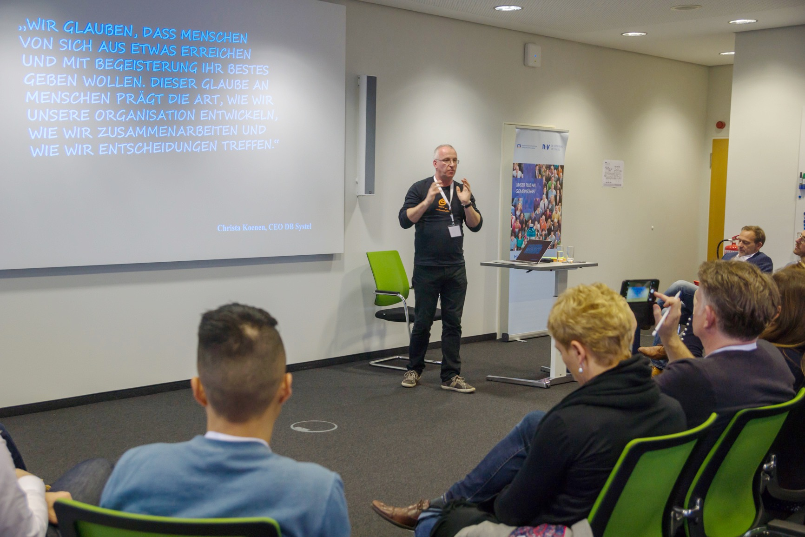
- 
- 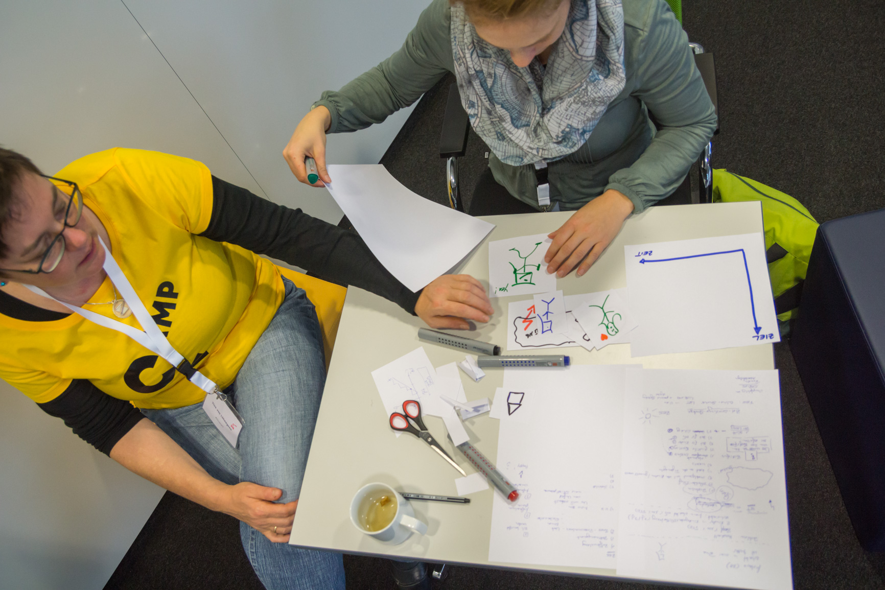
- 
- 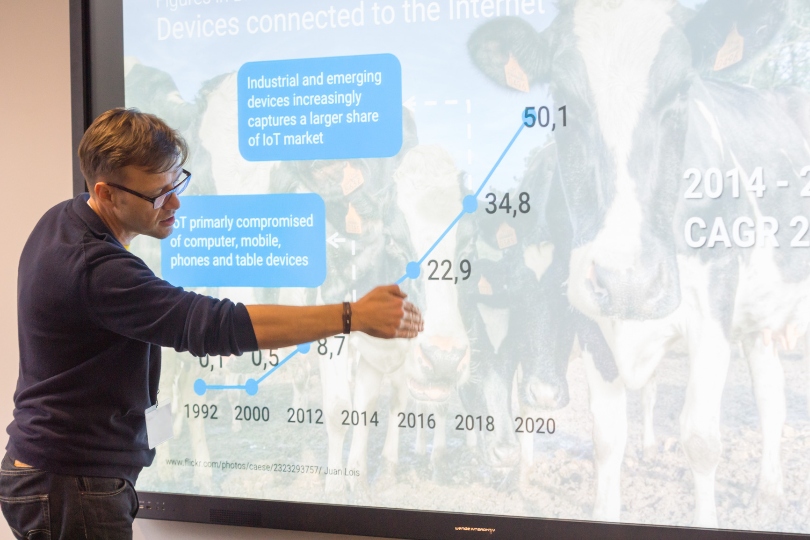
- 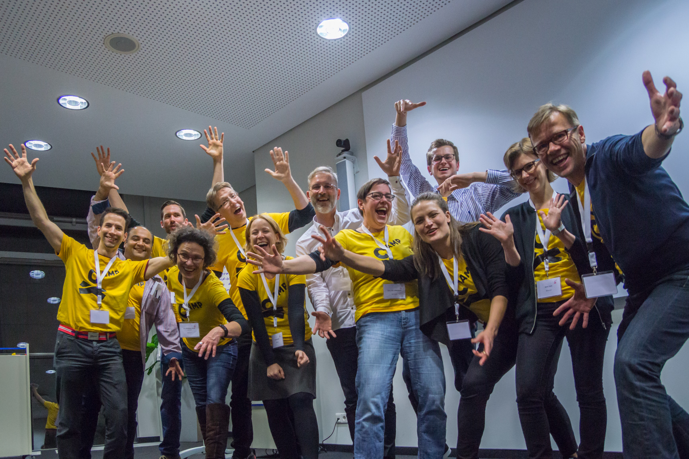

## Das Format des XCamp

%blocks%

1. Das XCamp wird als Open-Space organisiert. Die Inhalte werden von den Teilnehmern selbst bestimmt. Das Format wird
   auch (Un-) Konferenz bezeichnet. Es eröffnet den Teilnehmern ein Maximum an Interaktion, zudem ein hohes Maß an
   Inspiration und Lernfortschritt – insbesondere für Neulinge. Schwerpunkt des XCamps liegt auf den Themenfeldern
   Agiles Management und Innovation im Unternehmenskontext.
  
1. Im Hinblick zu einer traditionellen Konferenz gibt es wenige festgelegte Redner. Als Besucher der Konferenz kannst
   Du, wie jeder andere Teilnehmer, eine eigene Session halten. In dieser diskutierst Du beispielsweise Deine
   Erfahrungen zu einem Thema oder erhältst Best-Practice-Hinweise von anderen Teilnehmern.
  
1. Die [Agenda](#agenda) des XCamps, auch als Line-Up bezeichnet, wird in der Session-Planung zu Beginn bestimmt. Jeder
   Teilnehmer erhält die Chance, einen Beitrag zu leisten und an anderen interessante Beiträge teilzuhaben.

   *Prinzip Biene und Hummel*

   Während der Sessions entscheidet jeder für sich, ob er von Anfang bis zum Ende bleibt. Das sind die Bienen.
   Oder zwischendurch zu anderen, parallel laufenden Sessions wechselt. Das sind die Hummeln.

%blocks%

- =yellow

  ### Design Thinking kennlernen

  Mindset und Prozess in einer praktischen Übung mit Methode für Lösung von Problemen und Ideenentwicklung selbst erfahren. Der Quicky für Neugierige, die genauer wissen wollen, was die Innovationsmethode so attraktiv macht.
  Es wird auf die 6 Phasen des Design Thinking, auf ausgewählte Methoden und zahlreiche Beispiele aus der Praxis eingegangen.
  
- =yellow

  ### Lean Startup kennenlernen
  
  Unsicherheit in einem Gründungs- oder Innovationsvorhaben systematisch verringern.
  Neben den vorherrschenden Produktfokus tritt die Entwicklung eines reproduzierbaren Geschäftsmodells. Wir befassen uns mit dem Value Proposition Canvas, dem Lean Canvas, Hypothesenbildung und Experimenten.

- =yellow

  ### SCRUM - Agile Entwicklung kennenlernen
  
  Zunehmender Einsicht und veränderten Einflussgrößen im Projektverlauf Rechnung tragen. Wie arbeiten agile Projektteams? Welche Prinzipien liegen agilen Methoden zugrunde?
  Wir sprechen über Mindset und Ziele agiler Entwicklungsmethoden, wie Scrum und tauschen uns über geeignete Voraussetzungen zur Anwendung aus.

## Sponsoren

1. [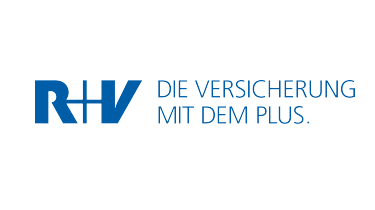](https://www.ruv.de/)
1. 
1. [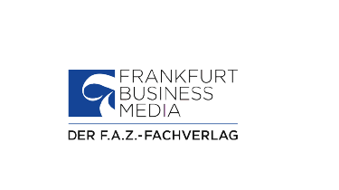](https://www.frankfurt-bm.com/)
1. 
1. 
1. [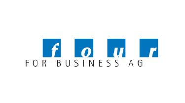](https://www.4fb.de/)
1. 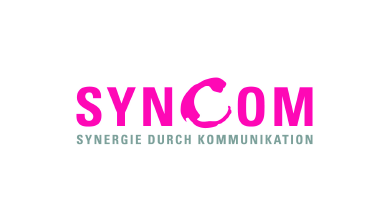
1. 
1. 

> ## Agenda
> 
> ### Samstag, 11.11.2017
> 
> 08:00 – Eintreffen, Check-in und Self-service Frühstück
> 
> 09:00 – Begrüßung durch den Veranstalter und Ansprache der Sponsoren
> 
> 09:30 – 5×3 Min Lightning Talks
> 
> 10:00 – Session-Planung
> 
> 11:00 – 1. Session Runde
> 
> 13:00 – Mittagspause & Networking
> 
> 14:15 – Workshop-Runde 2
> 
> 15:15 – Workshop-Runde 3
> 
> 16:00 – Kaffeepause
> 
> 16:30 – Workshop-Runde 4
> 
> 17:30 – Wrap-up und Verabschiedung
> 
> 18:00 – Networking
> 
> 19:00 – Gute Heimreise

    <iframe style="border: 0;"
            src="https://www.google.com/maps/embed?pb=!1m14!1m8!1m3!1d2561.2766717915024!2d8.27216!3d50.06238!3m2!1i1024!2i768!4f13.1!3m3!1m2!1s0x47bdbd85151e3283%3A0x3c8a9d8f45800890!2sAbraham-Lincoln-Park+1%2C+65189+Wiesbaden%2C+Deutschland!5e0!3m2!1sde!2sus!4v1501169650377"
            width="100%" height="450" allowfullscreen="allowfullscreen"></iframe>

    
<b>Veranstaltungsort</b>

        
    
R+V Akademie 
        Abraham-Lincoln-Park 1 
        65189 Wiesbaden
    

        
    
(Ehemaliges CSC Ploenzke Gebäude)

## Wir informieren dich: Updates, exklusive Angebote, Blick hinter die Kulissen

<a href="newsletter" class="big button turquoise">Newsletter abonnieren</a>

Du kannst dich zu jeder Zeit wieder von XCamp Newsletter abmelden. Einfach in der zuletzt erhaltenen E-Mail auf “Newsletter abbestellen” klicken.
