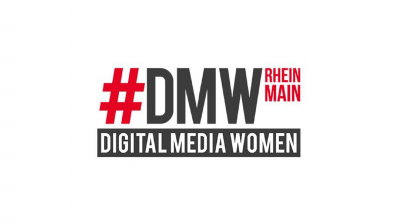

# XCamp 2018: Innovate agile. Start lean.

Am 25. August 2018 trafen auf dem XCamp die Innovationstreiber aus Unternehmen und Start-ups, Design Thinker, Agile und Lean Startup-Experten der Metropolregion Frankfurt Rhein Main zusammen.

%blocks%

- =magenta

  
  ### Zuhören und praktisch Eintauchen
  Erlebe Keynotes, hands-on Workshops und Open Space-Sessions zu Agilen Methoden, Lean Startup, Design Thinking, Business Modell Generation und den Erfolgsbedingungen für die Praxis.

- =yellow

  
  ### Inspiration erleben und vernetzen
  Gewinne durch Erfahrungsaustausch, interaktives Lernen und Workshops neue Einsichten und Motivation. Vernetze Dich mit Gleichgesinnten und Spezialisten, die neue Impulse geben.

- =white

  
  ### Schwung ins Unternehmen tragen
  Erfahre selbst, wie Du kreativer wirst und mehr Wirksamkeit in Innovationsprojekten erreichen kannst. Setze anschliessend das Gelernte bei Dir vor Ort erfolgreich in die Praxis.

## Letzte [Blog-News](blog) zum XCamp 18

%blocks%
<ul id="newest-blog-entries"></ul>

## Sessions auf dem XCamp 2018

%blocks%

- =magenta

  ### Martin Wolf
  %frame %
  
  [point of origin | Wien](https://www.pointoforigin.at/de/Mehr/Was-wir-tun/Team/iTeamId__75.htm)
  
  Keynote – Mastering Transformations with Human Psychology Hacks

- =turquoise

  ### Jim Kalbach
  %frame %
  
  [Experiencing Information](http://www.inspectandadapt.de/uber-mich/)
  
  Interactive Session (de/en) 
  Long Distance Relationships: Making Distributed Design Work

- =turquoise

  ### Doris Leinen
  %frame %
  
  [DB Systel](https://www.dbsystel.de/)
  
  Interactive Session (de/en) 
  Long Distance Relationships: Making Distributed Design Work

- =turquoise

  ### Oliver Zilken
  %frame %
  
  [Chief Scrum Master, Rewe Digital GmbH](https://www.xing.com/profile/Oliver_Zilken/)
  
  Wie können wir Scrum Master unsere Organisation agiler machen, ohne sie neu erfinden zu müssen?

- =turquoise

  ### Andreas Leicher
  %frame %
  
  [Kotaicode](http://kotaico.de/)
  
  Agile Architektur – Delivery Pipelines als Enabler für eine DevOps Kultur

- =turquoise

  ### Robert Gies
  %frame %
  
  [123Agile](http://robert-gies.de/)
  
  Der Weg in eine neue Arbeitswelt – Agilität ist nicht das primäre Ziel

- =turquoise

  ### Joachim Schirrmacher
  %frame %
  
  [DB Systel](https://www.dbsystel.de/)
  
  DevOps – Was soll das?
  
- =turquoise

  ### Daniel Dubbel
  %frame %
  
  [Inspect&Adapt](http://www.inspectandadapt.de/uber-mich/)
  
  Co-Moderation: Wie können wir Scrum Master unsere Organisation agiler machen, ohne sie neu erfinden zu müssen?
  
- =turquoise

  ### Katharina Berger
  %frame %
  
  [Innovate4People](http://innovate4people.com/)
  
  Agile – Design Thinking – Lean Startup – DevOps: Das eine oder das andere? Oder alles zusammen?
  
- =turquoise

  ### Benno Löwenberg
  %frame %
  
  [@BennoLoewenberg](https://twitter.com/BennoLoewenberg)
  
  Design-Systeme: UX skalierbar machen (Designer und Devs als Speed-Hero statt Sprint-Sisyphos)
  
- =turquoise

  ### Susanne Busshart

  %frame %
  
  [rosa & leo](http://www.rosaundleo.agency/)
  
  Der Mensch. Schlüsselfaktor für digitalen Erfolg.
  
- =turquoise

  ### Martin Weber-Schaeuffelen
  %frame %
  
  [Usability Testessen](http://www.usability-testessen.org/)
  
  Usability Testessen – Reloaded
  

## Eindrücke vom XCamp

<iframe src="https://www.youtube.com/embed/bPJKoiXNvz8?feature=oembed&amp;enablejsapi=1&amp;wmode=opaque" frameborder="0" allow="autoplay; encrypted-media" allowfullscreen="" id="player_1" name="fitvid0"></iframe>

## Das Format des XCamp

%blocks%

1. Das XCamp wird als Open-Space organisiert. Die Inhalte werden von den Teilnehmern selbst bestimmt. Das Format wird auch (Un-) Konferenz bezeichnet. Es eröffnet den Teilnehmern ein Maximum an Interaktion, zudem ein hohes Maß an Inspiration und Lernfortschritt – insbesondere für Neulinge. Schwerpunkt des XCamps liegt auf den Themenfeldern Agiles Management und Innovation im Unternehmenskontext.
  
1. Im Hinblick zu einer traditionellen Konferenz gibt es wenige festgelegte Redner. Als Besucher der Konferenz kannst Du, wie jeder andere Teilnehmer, eine eigene Session halten. In dieser diskutierst Du beispielsweise Deine Erfahrungen zu einem Thema oder erhältst Best-Practice-Hinweise von anderen Teilnehmern.
  
1. Die [Agenda](#agenda) des XCamps, auch als Line-Up bezeichnet, wird in der Session-Planung zu Beginn bestimmt. Jeder Teilnehmer erhält die Chance, einen Beitrag zu leisten und an anderen interessante Beiträge teilzuhaben.

%blocks%

- =yellow

  ### Design Thinking kennlernen
  Mindset und Prozess in einer praktischen Übung mit Methode für Lösung von Problemen und Ideenentwicklung selbst erfahren. Der Quicky für Neugierige, die genauer wissen wollen, was die Innovationsmethode so attraktiv macht.
  Es wird auf die 6 Phasen des Design Thinking, auf ausgewählte Methoden und zahlreiche Beispiele aus der Praxis eingegangen.
  
- =yellow

  ### Lean Startup kennenlernen
  Unsicherheit in einem Gründungs- oder Innovationsvorhaben systematisch verringern.
  Neben den vorherrschenden Produktfokus tritt die Entwicklung eines reproduzierbaren Geschäftsmodells. Wir befassen uns mit dem Value Proposition Canvas, dem Lean Canvas, Hypothesenbildung und Experimenten.

- =yellow

  ### SCRUM - Agile Entwicklung kennenlernen
  Zunehmender Einsicht und veränderten Einflussgrößen im Projektverlauf Rechnung tragen. Wie arbeiten agile Projektteams? Welche Prinzipien liegen agilen Methoden zugrunde?
  Wir sprechen über Mindset und Ziele agiler Entwicklungsmethoden, wie Scrum und tauschen uns über geeignete Voraussetzungen zur Anwendung aus.

> ## Call for Session
> Das XCamp lebt von vielseitigen Themenbeiträgen der Teilnehmer. Möchtest Du Erfahrungen über Innovationsmethoden teilen; Ratschläge, unterschiedliche Meinungen oder Perspektiven zu einem eigenen Vorhaben hören? Dann melde Dich gern vorab eine Session an. Zur Auswahl stet das gesamte Spektrum von Formaten, die für 45 Minuten geeignet sind:
> 
> - Kurzvortrag + Diskussion,
> - Hands-on Workshop,
> - Brainstorming,
> - Fishbowl,
> - Mind-Mapping
> - Pecha Cucha.
> - Für weitere Formate sind wir offen.
> 
> Mit einer frühzeitigen Anmeldung erhältst Du die Chance, einen Beitrag bereits vor dem allgemeinen Sessionaufruf am 25. August einzureichen. Bei Eignung wird Deine Session auf der Xcamp Webseite angekündigt und mit Deinem Bild veröffentlicht.
> 
> Zur Session-Anmeldung sende uns einfach eine Nachricht. Bitte Dein Ticket nicht vergessen.
> 
> Einsendeschluss ist der 15. Juli 2018

## Dein Kontakt

Wir informieren dich: Updates, exklusive Angebote, Blick hinter die Kulissen.

<a href="newsletter" class="big button turquoise">Newsletter abonnieren</a>

Du kannst dich zu jeder Zeit wieder von XCamp Newsletter abmelden. Einfach in der zuletzt erhaltenen E-Mail auf “Newsletter abbestellen” klicken.

## Sponsoren

1. 
1. 
1. 

## Netzwerkpartner

1. 
1. 
1. 
1. 

> ## Agenda
> 
> ### Samstag, 25.08.2018
> 08:00 – Eintreffen, Check-in und Self-Service Frühstück
> 
> 09:00 – Begrüßung
> 
> 09:40 -Martin Wolf: Mastering Transformation with Human Psychology Hacks
> 
> 10:30 – Session-Planung
> 
> 11:45  – Martin Wolf: In your face: Transformation Barrieren finden, erleben und meistern.
> 
> 12:30 – Mittagspause & Networking
> 
> 13:30 – 2 . Session Runde
> 
> 14:30 – 3. Session Runde
> 
> 15:30 – Kaffeepause
> 
> 16:00 – 4 .Session Runde
> 
> 17:00 – 5. Session Runde
> 
> 18:00 – Closing und anschliessendes Networking
> 
> 19:00 – Gute Heimreise

    <iframe style="border: 0;"
            src="https://www.google.com/maps/embed?pb=!1m18!1m12!1m3!1d4007.840430949455!2d8.665983995064554!3d50.108191103824126!2m3!1f0!2f0!3f0!3m2!1i1024!2i768!4f13.1!3m3!1m2!1s0x0%3A0x295910c3a828480!2sDB+Systel+GmbH!5e0!3m2!1sen!2sde!4v1563117709421!5m2!1sen!2sde"
            width="100%" height="450" allowfullscreen="allowfullscreen"></iframe>

    
<b>DB Systel GmbH</b> 
        Skydeck im Silberturm

    
Jürgen-Ponto-Platz 1 
        60329 Frankfurt am Main

