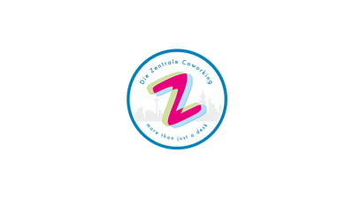
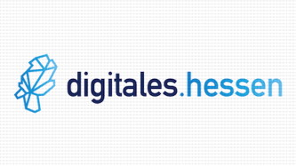

# Innovating Agile
Am 13. September 2019 treffen auf dem XCamp die Innovationstreiber aus Unternehmen und Start-ups, Design Thinker, Agile und Lean Startup-Experten der Metropolregion Frankfurt Rhein Main zusammen.

<a href="tickets" class="big button yellow">Jetzt Ticket kaufen</a>
<a href="./" class="big button turquoise">Jetzt vernetzen</a>

- =magenta

  
  ### Zuhören und praktisch Eintauchen
  Erlebe Keynotes, hands-on Workshops und Open Space-Sessions zu Agilen Methoden, Lean Startup, Design Thinking, Business Modell Generation und den Erfolgsbedingungen für die Praxis.

- =yellow

  
  ### Inspiration erleben und vernetzen
  Gewinne durch Erfahrungsaustausch, interaktives Lernen und Workshops neue Einsichten und Motivation. Vernetze Dich mit Gleichgesinnten und Spezialisten, die neue Impulse geben.

- =turquoise

  
  ### Schwung ins Unternehmen tragen
  Erfahre selbst, wie Du kreativer wirst und mehr Wirksamkeit in Innovationsprojekten erreichen kannst. Setze anschliessend das Gelernte bei Dir vor Ort erfolgreich in die Praxis.

## Letzte [Blog-News](blog) zum XCamp 19

## Eindrücke vom XCamp

<iframe src="https://www.youtube.com/embed/bPJKoiXNvz8?feature=oembed&amp;enablejsapi=1&amp;wmode=opaque" frameborder="0" allow="autoplay; encrypted-media" allowfullscreen="" id="player_1" name="fitvid0"></iframe>

## Das Format des XCamp

1. Das XCamp wird als Open-Space organisiert. Die Inhalte werden von den Teilnehmern selbst bestimmt. Das Format wird auch (Un-) Konferenz bezeichnet. Es eröffnet den Teilnehmern ein Maximum an Interaktion, zudem ein hohes Maß an Inspiration und Lernfortschritt – insbesondere für Neulinge. Schwerpunkt des XCamps liegt auf den Themenfeldern Agiles Management und Innovation im Unternehmenskontext.
  
1. Im Hinblick zu einer traditionellen Konferenz gibt es wenige festgelegte Redner. Als Besucher der Konferenz kannst Du, wie jeder andere Teilnehmer, eine eigene Session halten. In dieser diskutierst Du beispielsweise Deine Erfahrungen zu einem Thema oder erhältst Best-Practice-Hinweise von anderen Teilnehmern.
  
1. Die Agenda des XCamps, auch als Line-Up bezeichnet, wird in der Session-Planung zu Beginn bestimmt. Jeder Teilnehmer erhält die Chance, einen Beitrag zu leisten und an anderen interessante Beiträge teilzuhaben.

## Jetzt teilnehmen!

Am 13. September 2019 im Skydeck der DB Systel im Silberturm diskutieren Experten im Herzen von Frankfurt über Praxiserfahrungen mit Methoden und Prozessen rund um innovative Service- und Produktentwicklung. Einsteiger erhalten Hands-on-Zugang zu Methoden wie Lean Startup, Scrum, OKR, Agil, Projektmanagement, WOL, Digital Workplace, UI, UX und Design Thinking.

Ähnlich zu den vergangenen LeanCamps und XCamps gibt es viel Inspiration, Vernetzung und neue Schubkraft für eigene Projekte.

- =magenta has-bottom-buttons sold-out

  ### Selbstzahler-Ticket
  Mit diesem Ticket holst Du dir als Selbstzahler den Zugang zum Event, Verköstigung und Getränke. Verpass nicht diese
  einmalige Chance!
  <a href="tickets?type=private" class="button button--light align-bottom ticket-button" target="_self" disabled="true">148,75 € Ticket kaufen</a>

- =yellow has-bottom-buttons sold-out

  ### Unternehmensticket
  Mit einem Unternehmensticket erhältst Du als Mitarbeiter eines Unternehmens den vollen Zugang zur Veranstaltung für
  den gesamten Tag inklusive Verköstigung und Getränke. Kauf auf Rechnung ist hier möglich.
  <a href="tickets?type=corporate" class="button button--light align-bottom ticket-button" target="_self" disabled="true">297,50 € Ticket kaufen</a>

- =turquoise has-bottom-buttons sold-out

  ### Vergünstigtes Ticket
  Du studierst, gründest gerade oder bist in einer finanziell engen Phase und interessierst dich für innovate agile?
  Wir haben eine begrenzte Anzahl an Tickets reserviert. Bewirb dich für den vollen Zugang zur Veranstaltung für den
  ganzen Tag.
  <a href="tickets?type=reduced" class="button button--light align-bottom ticket-button" target="_self" disabled="true">35,00 € Ticket anfragen</a>

## Du kannst dich noch nicht für ein Ticket entscheiden?
Wir halten dich auf dem Laufenden, wenn du dich in unserem Newsletter einträgst

<a href="newsletter" class="big button turquoise">Newsletter abonnieren</a>

## Sponsoren

1. 
1. 
1. 
1. 
1. 

## Netzwerkpartner

1. 
1. 
1. 
1. 
1. 

    <iframe style="border: 0;"
            src="https://www.google.com/maps/embed?pb=!1m18!1m12!1m3!1d4007.840430949455!2d8.665983995064554!3d50.108191103824126!2m3!1f0!2f0!3f0!3m2!1i1024!2i768!4f13.1!3m3!1m2!1s0x0%3A0x295910c3a828480!2sDB+Systel+GmbH!5e0!3m2!1sen!2sde!4v1563117709421!5m2!1sen!2sde"
            width="100%" height="450" allowfullscreen="allowfullscreen"></iframe>

    
<b>DB Systel GmbH</b> 
        Skydeck im Silberturm

    
Jürgen-Ponto-Platz 1 
        60329 Frankfurt am Main

