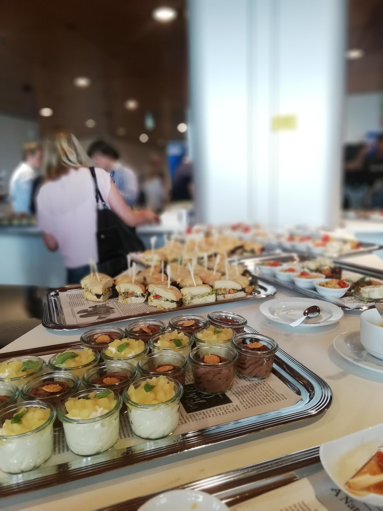
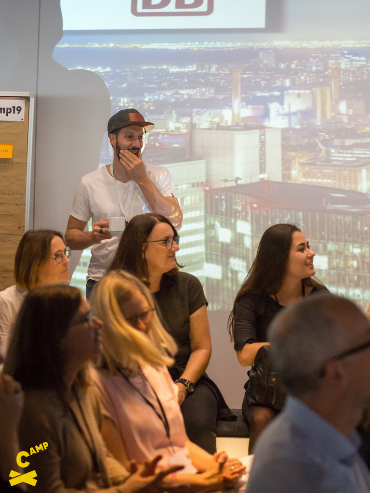
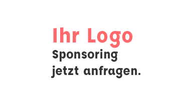

# Innovating Agile

Auf dem XCamp treffen die Innovationstreiber aus Unternehmen und Start-ups, Design Thinker, Agile und Lean Startup-Experten der Metropolregion Frankfurt Rhein Main zusammen.

%blocks%

1. =yellow

   Bis wir wieder ein echtes XCamp veranstalten dürfen, starten wir mit einer Reihe digitaler Meetups. Den Auftakt machen wir am 26. Juni 2020 mit dem **XCamp Digital Meetup**. Es wird ein virtuelles, kompaktes Barcamp geben. Zudem  starten wir den Community Chat, die Plattform zur themenbezogenen Vernetzung für Agilität, Innovation und die besten Methoden dazu.

1. =yellow

   [%big magenta button: Mehr Infos%](meetup/2020-06-26-digital-meetup)

<!--[%big yellow button: Jetzt Ticket kaufen%](tickets)-->
[%big turquoise button: Das war das XCamp 2019%](blog/2019-09-22-impressions-of-xcamp-2019)

## Was ist das XCamp?

%blocks%

1. =white block

  Beim XCamp 2020 wollen wir praktisch arbeiten statt nur darüber reden. Ideengeber mit klaren Missionen tragen ihre Themen im Vorfeld auf der Website und am Vorabend persönlich vor. Das ist Deine Chance, Ratgebende und Mitmachende für Deine Vision zu gewinnen!

1. =white block

  Am Workshop-Tag treffen sich die Teams in Workshop Sessions und bringen das Thema ein konkretes Stück voran. Am Ende des XCamp sind die Ideengeber einen wichtigen Schritt vorangekommen. Mitmacher und Ratgeber wissen, dass sie etwas zu einer guten Sache beigetragen haben.

2. =white

  Nach dem XCamp haben alle neue Erfahrungen gemacht und Kontakte geknüpft und bringen diese auch in ihre tägliche Arbeit ein. Inspiration, Methodenwissen und neuer Schwung für Beruf und persönliche Entwicklung.

## Barcamp für Macher, Innovations Treiber & Agilisten

%blocks%

- =magenta

  ### :star: Ideengeber

  Bringe Dein Thema zum XCamp mit, das du gerne vorantreiben möchtest. Beim XCamp bekommst du die einmalige Chance, von Experten begleitet zu werden und gewinnst Mitstreiter für deine Sache.

  [%yellow button: Projekt vorschlagen%](mailto:purpose@xcamp.co?subject=Projektvorschlag%20für%20das%20XCamp%202020)

- =yellow

  ### :search: Methodiker

  Du bringst Deine Expertise ins Spiel und bekommst die Möglichkeit, Deine Methoden Werkzeuge zu testen - mit echten Fällen direkt aus Praxis für eine bessere Welt.

- =turquoise block

  ### :checkmark: Mitmacher

  Lerne durch Mitwirkung und sei Teil innovativer, sinnvoller Projekte beim XCamp! Echte Use Cases werden unter die Lupe genommen und Du lernst sehr praxisnah.

## XCamp 2020 ist in Planung

Im Herbst 2020 werden sich wieder Experten über Praxiserfahrungen mit Methoden und Prozessen rund um innovative Service- und Produktentwicklung diskutieren und austauschen. Einsteiger erhalten Hands-on-Zugang zu Methoden wie Lean Startup, Scrum, OKR, Agil, Projektmanagement, WOL, Digital Workplace, UI, UX und Design Thinking.

Ähnlich zu den vergangenen LeanCamps und XCamps gibt es viel Inspiration, Vernetzung und neue Schubkraft für eigene Projekte.

[%big turqouise button: Informiert bleiben%](newsletter)
[%big turqouise button: Vernetzen%](https://community.xcamp.co)

## Impressionen vom XCamp

%blocks%

1. 
2. 
3. 
4. 
5. 
6. 
7. [%big turquoise button: Das war das XCamp 2019%](blog/2019-09-22-impressions-of-xcamp-2019)

## Letzte [Blog-News](blog) zum XCamp

%blocks%
<ul id="newest-blog-entries"></ul>

## Eindrücke vom XCamp

<iframe src="https://www.youtube.com/embed/bPJKoiXNvz8?feature=oembed&amp;enablejsapi=1&amp;wmode=opaque" frameborder="0" allow="autoplay; encrypted-media" allowfullscreen="" id="player_1" name="fitvid0"></iframe>

<!--
## Das Format des XCamp-->
<!--
1. Das XCamp wird als Open-Space organisiert. Die Inhalte werden von den Teilnehmern selbst bestimmt. Das Format wird auch (Un-) Konferenz bezeichnet. Es eröffnet den Teilnehmern ein Maximum an Interaktion, zudem ein hohes Maß an Inspiration und Lernfortschritt – insbesondere für Neulinge. Schwerpunkt des XCamps liegt auf den Themenfeldern Agiles Management und Innovation im Unternehmenskontext.-->
<!--  
1. Im Hinblick zu einer traditionellen Konferenz gibt es wenige festgelegte Redner. Als Besucher der Konferenz kannst Du, wie jeder andere Teilnehmer, eine eigene Session halten. In dieser diskutierst Du beispielsweise Deine Erfahrungen zu einem Thema oder erhältst Best-Practice-Hinweise von anderen Teilnehmern.-->
<!--  
1. Die Agenda des XCamps, auch als Line-Up bezeichnet, wird in der Session-Planung zu Beginn bestimmt. Jeder Teilnehmer erhält die Chance, einen Beitrag zu leisten und an anderen interessante Beiträge teilzuhaben.-->

## Sponsoren

1. 

<!--## Netzwerkpartner-->

    <!--iframe style="border: 0;"
            src="https://www.google.com/maps/embed?pb=!1m18!1m12!1m3!1d4007.840430949455!2d8.665983995064554!3d50.108191103824126!2m3!1f0!2f0!3f0!3m2!1i1024!2i768!4f13.1!3m3!1m2!1s0x0%3A0x295910c3a828480!2sDB+Systel+GmbH!5e0!3m2!1sen!2sde!4v1563117709421!5m2!1sen!2sde"
            width="100%" height="450" allowfullscreen="allowfullscreen"></iframe-->

<!--div class="yellow box">
    
<b>DB Systel GmbH</b> 
        Skydeck im Silberturm

    
Jürgen-Ponto-Platz 1 
        60329 Frankfurt am Main

</div-->

